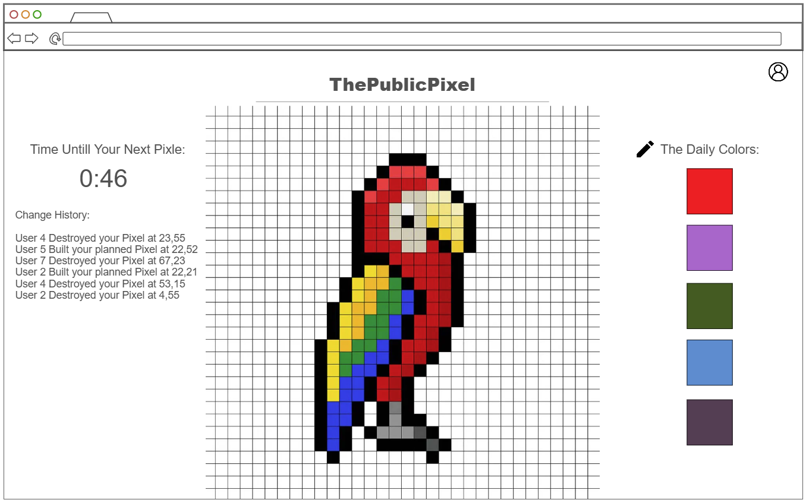

# [The Public Pixel](https://startup.haypers.com/)

The public pixel is a community made pixel art engeine. Inspired by r/place, this will be a home for strangers to colaborate on pixle art.

Every five minutes (Or maybe every 30 seconds or something, still deciding.) a user may color a pixle. Between these moments, a user can 'plan' for a pixle, denoting that they plan for it to match a certain color in the future. When placing a pixle, users will be informed of any plans for that pixle and will have the opporutnity to accept or reject the plan.

Users get a log of users who accept their plan or override a pixle they built.

### Elevator pitch

Have you ever wanted to make fun pixel art, but don't know where to start? don't worry! The public Pixel is where you can have fun making pixel art with the public, while engaging in a gamified turf war. Color pixles with the colors of the day, provided by a third party, and plan for future works to seek the colaboration of the internet.

### Design
[view the ninjamock](https://ninjamock.com/s/TDX91Lx)

### Key features

- Users can color pixles with the color of the day every 5 minutes.
- Users can plan for a pixle so other users can see that plan - When a user clicks on a pixle, a simple menu of users will be provided who currently have a plan for that pixle. Hovering over those user names will render their full plan on the screen. You can choose to follow a plan, or ignore them all.
- Users can have a log of relivent changes.

### Technologies

- **HTML** - Text boxes for timer, and UI, and placeholder squares.
- **CSS** - Format timer, keep UI clean.
- **React** - Encode, decode pixle array, and plans array. Allow the user to select a color from the pallet, and mark a pixel with that color. Also allow the user to plan for up to 40ish pixels, and notify a user if they ever select a pixle that has a plan so they can preview the plan, and decide to follow it or not. A super simple overlay grapfic will show the user the planned pixles from the other user. 
- **Service** - Send/receive chaning pixles, and plans, and notifications. Keep a record of timestamps when the user submit the last pixle so you can authenticate if they are allowed to submit another.
- **DB/Login** - need an account to know when you can make a change to the public pixel art. Store the array of public pixels, as well as an array of user data that contains planned pixels, and a log of the last few relivent changes.
- **WebSocket** - The colors of the day will be dependet on [zoodinkers color of the day](https://colors.zoodinkers.com/) I will also add a script that generates a few more hex codes by offseting that zoodinkers one, so the user has about 5 colors every day to choose from. Additionaly, users can receve websocket notifications from the server when another user makes an action. This will keep all clients up to date.

## 🚀 deliverables
- [x] Proper use of Markdown
- [x] A concise and compelling elevator pitch
- [x] Description of key features
- [x] Description of how you will use each technology
- [x] One or more rough sketches of your application.
- [x] **Server deployed and accessible with custom domain name** - [Haypers.com](https://startup.haypers.com/).
- [x] **HTML pages** - I have the project organized into 4 pages at the present, but if I can remove one I will. I think I might be able to make the history tab just a feature on the main game page. 
- [x] **Proper HTML element usage** - I've got a lot in there now, but I'll be needing a lot of css to make it look good.
- [x] **Links** - In the header I have links to the 4 pages, and I have this in all of the pages.
- [x] **Text** - The first page is the best example. I have example elements in there that I will make appear on the sides of the pixle art if the screen is big enough.
- [x] **3rd party API placeholder** - The color of the day section will be populated with colors provided from 3rd parties.
- [x] **Images** - I got my fabicon working! kinda fun. I'm going to pull in some svgs for the icons soon too.
- [x] **Login placeholder**  - I have an account tab that I pulled from simon.
- [x] **DB data placeholder** - The history tab will have a screenshot of the art from every day. But It's not really a screenshot. I'll probably render these the same way as the home page art, and just store an array of what the data looked like at 9am every day or something.
- [x] **WebSocket placeholder** - On the homepage I have the Notifications area where the user will get server sent websocket messages about pixle changes. 
- [x] **Header, footer, and main content body** - Used bootstrap for basic stuff, but for main page I had to do some crazy stuff to get the art to scale correctly.
- [x] **Navigation elements** - I'm going to keep those elements simple, but I might give them a box at some point too. I did make sure the css for the header is consistent across all 4 pages.
- [x] **Responsive to window resizing** - This took a while to get right on the main page. I found a tutorial on column mode formating, but for the longest time my columns tried to render on seperate rows, so I had to specify rows for each of my elements.
- [x] **Application elements** - You'll notice that the color pallets move to a horizontal allignment under the art if the screen becomes narrow, and they scale to match the width of the screen in that case.
- [x] **Application text content** - The text is in 2 sections, each set to a fixed width of 250 px. I need to add some scaling, but I'm afraid to get my heart set on any sizeing untill I have some JS modifying the text so I know how long the words will be.
- [x] **Application images** - I got the grid scaling well, and a little brush icon by the colors.
- [x] **Bundled using Vite** - and deployed.
- [x] **Components** - split into 4, simalar to simon.
- [x] **Router** - the nav bar works as expected.
## 🚀 React part 2: Reactivity
- [x] **All functionality implemented or mocked out** - I've got all the basic functionality working.  You can make an account, view a static pixel art grid, change a pixel every 15 seconds, and even view an hour by hour history of your pixels in the history tab. Because I have no backend yet, I've set the pixel page to check for history 'snapshots' every few minutes. So if you leave your pixels window open for a few minutes when logged in, it will start adding the hour by hour screenshots. I even got some fake 'users' changing pixels, but there is a weird bug with my timer loop, so I've turned it off by default.
- [x] **Hooks** - Tons of hooks. I use them to change the color pallet, the pixels, the timer, and the notifications. 

## 🚀 Service deliverable

For this deliverable I did the following. I checked the box `[x]` and added a description for things I completed.

- [ ] **Node.js/Express HTTP service** - I did not complete this part of the deliverable.
- [ ] **Static middleware for frontend** - I did not complete this part of the deliverable.
- [ ] **Calls to third party endpoints** - I did not complete this part of the deliverable.
- [ ] **Backend service endpoints** - I did not complete this part of the deliverable.
- [ ] **Frontend calls service endpoints** - I did not complete this part of the deliverable.

## 🚀 DB/Login deliverable

For this deliverable I did the following. I checked the box `[x]` and added a description for things I completed.

- [ ] **User registration** - I did not complete this part of the deliverable.
- [ ] **User login and logout** - I did not complete this part of the deliverable.
- [ ] **Stores data in MongoDB** - I did not complete this part of the deliverable.
- [ ] **Stores credentials in MongoDB** - I did not complete this part of the deliverable.
- [ ] **Restricts functionality based on authentication** - I did not complete this part of the deliverable.

## 🚀 WebSocket deliverable

For this deliverable I did the following. I checked the box `[x]` and added a description for things I completed.

- [ ] **Backend listens for WebSocket connection** - I did not complete this part of the deliverable.
- [ ] **Frontend makes WebSocket connection** - I did not complete this part of the deliverable.
- [ ] **Data sent over WebSocket connection** - I did not complete this part of the deliverable.
- [ ] **WebSocket data displayed** - I did not complete this part of the deliverable.
- [ ] **Application is fully functional** - I did not complete this part of the deliverable.
